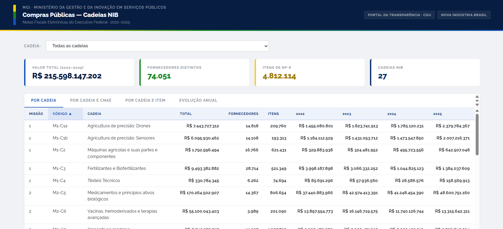
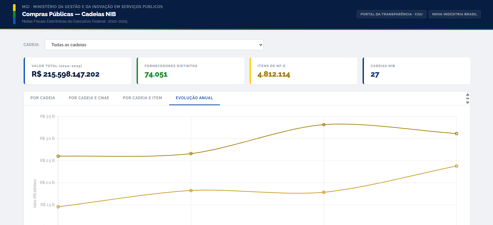

# Concatenação dos arquivos de Notas Fiscais do [Portal da Transparência](https://portaldatransparencia.gov.br/) para consultas rápidas em SQL, usando DuckDB

## Preparação do ambiente de desenvolvimento

Clonar este repositório na sua máquina, executando:

```bash
git clone https://github.com/heitorgama/nfe-cgu
```

Criar e ativar ambiente virtual, executando, a partir da raiz do repositório clonado:

```bash
 python3 -m venv env
 source myenv/bin/activate
 ```

Instalar o gerenciador de pacotes `pip` caso não esteja instalado, executando:

```bash
python3 -m venv my_env
```

Instalar as bibliotecas necessárias, executando:

```bash
pip install -r requirements.txt
```

## Obtenção dos microdados das notas fiscais

Os arquivos de notas fiscais eletrônicas são disponibilizados mensalmente em: https://portaldatransparencia.gov.br/download-de-dados/notas-fiscais

Baixar os arquivos `.zip` referentes aos meses de interesse no diretório `dados/nfe`.

## Concatenação dos arquivos em um único .parquet e remover duplicatas

Executar o script `concatenar_nfs.py` para concatenar os arquivos `.zip` baixados, executando:

```bash
python concatenar_nfs.py
```

O script irá extrair os arquivos `.zip` e concatenar os dados em um arquivo Parquet chamado `nfe.parquet` no diretório `extracoes`.
Os **itens** das notas fiscais serão extraídos para um arquivo separado chamado `itens.parquet`.
Os **eventos** de notas fiscais serão extraídos para um arquivo chamado `eventos.parquet`.

A seguir, é preciso excluir notas duplicadas, executando o script `remover_duplicatas_nfe.py`:

```bash
python remover_duplicatas_nfe.py
```

A base de **notas fiscais** deduplicada será salva como `nf_limpas.parquet`.
A base de **itens** deduplicada será salva como `itens_limpos.parquet`.

# Exemplo de consulta ao arquivo final

O arquivo `consultar_aco.py` contém consultas SQL para analisar os dados extraídos, a fim de obter o volume total comprado pelo Executivo Federal. Você pode executar essas consultas usando o DuckDB, que é uma biblioteca de banco de dados SQL leve e rápida.

# Painel interativo (exemplo com Cadeias NIB)

O script final pipeline/gold.py gera um painel HTML interativo (extracoes/gold/cruzamento_ncm/preview.html) com os dados de compras públicas, cruzando as Notas Fiscais Eletrônicas do Executivo Federal com o mapeamento NCM definido pelo MGI.
O painel roda inteiramente no navegador via DuckDB-WASM sem servidor, sem dependências externas além do arquivo .html.


<sub>Aba <strong>Por Cadeia e CNAE</strong> - valores agregados por cadeia produtiva e classificação CNAE</sub>
<br><br>

<sub>Aba <strong>Evolução Anual</strong> - série histórica 2022-2025 por cadeia</sub>